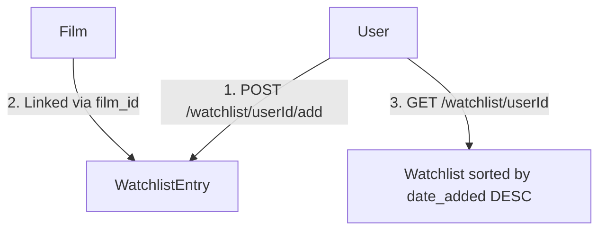

# Demystifying Git Rebasing & Feature Architecture: Building the CineLog Watchlist

Whether you are building new APIs or working with a team, managing git branches and database migrations is a core software engineering skill. Recently, we implemented a new **Watchlist Feature** in CineLog and successfully rebased it on top of a major database refactor from the `main` branch. 

In this blog post, we'll break down:
1. **The Feature Design**: What the Watchlist feature actually is and why we made specific design decisions.
2. **Git Rebasing vs. Merging**: The difference, and why rebasing is so powerful.
3. **Resolving Database Conflicts**: How we migrated from integer primary keys to UUID strings, fixed failing tests, and resolved git conflicts.
4. **Git Commands Cheat Sheet**: Essential Git commands to help you master source control.

---

## 🚀 1. The Watchlist Feature: Architecture & Privacy by Design

The goal was simple: allow users to save films they want to watch later.



### Key Design Decisions

*   **Privacy by Design (`public=False`)**:  
    When users save films to a watchlist, it defaults to private. Privacy should always be opt-in, not opt-out. Defaulting to private protects user data from unwanted exposure, even if it slightly reduces viral sharing loops.
*   **Dynamic Sorting (Newest First)**:  
    Instead of sorting watchlists alphabetically, they are sorted by `date_added` descending (most recently saved first). This ensures the user's active interests are right at the top, matching the behavior of CineLog's film collections.
*   **API Consistency**:  
    We renamed the service from `save_to_watchlist` to `add_to_watchlist` to adhere to the project's consistent `verb_to_noun` pattern (matching `add_to_collection`).

---

## 🔄 2. Git Rebasing: Keeping a Clean History

When you work on a feature branch, other developers are simultaneously pushing commits to the main branch (`main`). To integrate their latest changes, you have two options: **Merging** or **Rebasing**.

| Feature | Git Merge (`git merge main`) | Git Rebase (`git rebase main`) |
| :--- | :--- | :--- |
| **How it Works** | Combines the branches by creating a new "merge commit". | Plucks your commits, temporarily sets them aside, moves your branch pointer to the latest commit on `main`, and reapplies your commits one-by-one on top. |
| **History** | Preserves the exact chronological order of commits, resulting in a complex tree of branches. | Rewrites the commit history to be linear, clean, and easy to read. |
| **Force Push** | Not required. | Required (`git push --force-with-lease`) if the branch was already pushed to remote. |

### The Rebase Workflow

```
Before Rebase:
      A---B---C (feature/watchlist)
     /
D---E---F (main)

After Rebase:
          A'---B'---C' (feature/watchlist on top of main)
         /
D---E---F (main)
```

By rebasing, we ensure that our watchlist changes apply cleanly on top of the newest codebase state.

---

## 🛠 3. Under the Hood: Resolving the Schema Conflict

During our rebase onto `main`, we encountered conflicts because another developer changed the film identifiers from integers to **UUID strings** (UUIDv4) in the database schema.

### The Conflict:
*   Our branch defined `WatchlistEntry.film_id` as an `db.Integer` foreign key.
*   The `main` branch migrated `Film.id` to `db.String(36)` (UUID).
*   Git paused the rebase, showing a conflict in `models.py`.

### How We Resolved It:
1.  **Updated Schema**: Changed `film_id` in our junction table from `Integer` to `String(36)` to match the new UUID format:
    ```python
    film_id = db.Column(db.String(36), db.ForeignKey('film.id'), primary key=True)
    ```
2.  **Repaired Unit Tests**: Our tests were using dummy integer IDs (like `999999`) to assert missing films. We updated the tests to use string UUIDs (e.g., `"nonexistent-uuid-string"`) to prevent type mismatches.
3.  **Restored Relationships**: We added relationships to the `User` and `Film` models so Python objects can easily resolve related entries (e.g., accessing `entry.film` directly).
4.  **Completed Rebase**: Staged the resolved files with `git add` and ran `git rebase --continue`.

---

## 📘 4. Git & GitHub Cheat Sheet

Use this cheat sheet to master your command-line workflow:

### 1. Daily Workflow
*   **Check workspace status**:
    ```bash
    git status
    ```
*   **See changes line-by-line**:
    ```bash
    git diff
    ```
*   **Stage changes**:
    ```bash
    git add <filename>    # Stages specific file
    git add .             # Stages all changed files
    ```
*   **Commit staged changes**:
    ```bash
    git commit -m "feat: implement watchlist sorting"
    ```

### 2. Rebasing & Pushing
*   **Rebase your branch on top of main**:
    ```bash
    # Step 1: Get the latest code from main
    git checkout main
    git pull
    # Step 2: Switch to feature branch and rebase
    git checkout feature/watchlist
    git rebase main
    ```
*   **Resolve a conflict**:
    1. Open conflicting files and fix the code manually.
    2. Stage files: `git add <resolved_file>`
    3. Resume rebase: `git rebase --continue` (never run `git commit` during a rebase).
*   **Force push your clean rebased branch to remote**:
    ```bash
    git push --force-with-lease
    ```
    *(Tip: `--force-with-lease` is safer than `-f` because it prevents overwriting someone else's commits if they pushed to your branch in the meantime).*

---

### Conclusion
By keeping commits focused, writing clean unit tests, and understanding how Git manages history through rebasing, we successfully shipped the **Watchlist Feature** with a clean, conflict-free commit history!
