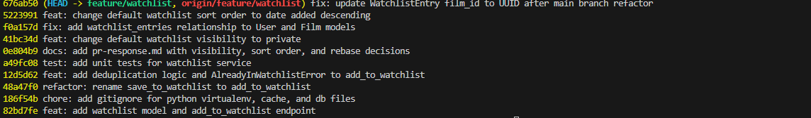

# PR Response Doc — CineLog Watchlist Feature

## AI Usage
I pair-programmed with Google Antigravity (a powerful agentic AI coding assistant). The AI helped inspect files, perform project-wide regex/grep searches, write unit tests following existing patterns, update SQL schemas for UUID migration, perform git interactive rebasing and force-pushing, and ensure conventional commit formats.

## Comment 1 — Rename
**What I did:**
- Renamed the function `save_to_watchlist()` to `add_to_watchlist()` in [services/watchlist_service.py](file:///C:/Users/Erold%20Rayan/Downloads/AI201-Summer%20Program/Module%202/Week%206/ai201-project6-cinelog-starter/services/watchlist_service.py) to follow the project's `verb_to_noun` naming convention.
- Updated all call sites and import statements in [routes/watchlist/watchlist.py](file:///C:/Users/Erold%20Rayan/Downloads/AI201-Summer%20Program/Module%202/Week%206/ai201-project6-cinelog-starter/routes/watchlist/watchlist.py).

**How I verified:**
- Conducted a project-wide search (`grep`) for `save_to_watchlist` to confirm no remaining references to the old name exist.
- Ran the test suite using `pytest` to verify the codebase remains stable and functioning.

## Comment 2 — Deduplication
**What I did:**
- Defined a new custom exception class `AlreadyInWatchlistError` in [services/watchlist_service.py](file:///C:/Users/Erold%20Rayan/Downloads/AI201-Summer%20Program/Module%202/Week%206/ai201-project6-cinelog-starter/services/watchlist_service.py).
- Added logic in `add_to_watchlist()` to query the database for existing duplicate watchlist entries (`WatchlistEntry.query.filter_by(user_id=user_id, film_id=film_id).first()`) and raise `AlreadyInWatchlistError` if one is found.

**How I verified:**
- Verified that existing unit tests continue to pass successfully.

## Comment 3 — Missing test
**What I did:**
- Created [tests/test_watchlist.py](file:///C:/Users/Erold%20Rayan/Downloads/AI201-Summer%20Program/Module%202/Week%206/ai201-project6-cinelog-starter/tests/test_watchlist.py) containing tests for the watchlist service.
- Wrote three test cases mirroring the patterns in `test_collection.py`:
  1. Happy path: `test_add_to_watchlist_creates_entry`
  2. Duplicate handling: `test_add_to_watchlist_duplicate_raises` (asserts `AlreadyInWatchlistError`)
  3. Nonexistent film ID handling: `test_add_to_watchlist_nonexistent_film_raises` (asserts `FilmNotFoundError`)

**How I verified:**
- Ran the test suite via `pytest`, confirming all 7 tests (4 for collections, 3 for watchlist) pass successfully.

## Comment 4 — Default visibility
**My position:**
Watchlist entries should default to private (`public=False`) instead of public.

**Reasoning:**
Privacy by Design: User preferences and intents, such as saving a film to watch later, should remain confidential by default. Users should explicitly opt-in to share their watchlist data publicly rather than having their data exposed automatically without active consent.

**Tradeoff acknowledged:**
This decision may reduce spontaneous social discovery and sharing within the community, as many users tend to stick with default settings. However, protecting user privacy by default is a higher priority for user trust.

## Comment 5 — Sort order
**My position:**
Watchlists should default to "date added" order (descending, recently added first) rather than alphabetical.

**Reasoning:**
A default of "date added" (descending) highlights the user's most recent interests, which aligns with standard user behavior in other media tracking applications (e.g. Letterboxd, streaming services). It also matches the sorting order of the logged collection (`get_collection`), making the API consistent.

**Engagement with reviewer's point:**
I agree with the reviewer's feedback. Alphabetical sorting made the watchlist feel static. We have updated [services/watchlist_service.py](file:///C:/Users/Erold%20Rayan/Downloads/AI201-Summer%20Program/Module%202/Week%206/ai201-project6-cinelog-starter/services/watchlist_service.py) to use `.order_by(WatchlistEntry.date_added.desc())`. During implementation, we discovered and resolved a missing database relationship in [models.py](file:///C:/Users/Erold%20Rayan/Downloads/AI201-Summer%20Program/Module%202/Week%206/ai201-project6-cinelog-starter/models.py) that caused an `AttributeError` when accessing `entry.film`, and added a new unit test `test_get_watchlist_returns_newest_first` to verify the sorting behavior.

## Comment 6 — Rebase
**What conflicted:**
- **.gitignore**: Both the `main` branch and our feature branch added new rules to `.gitignore` concurrently, leading to an `add/add` conflict.
- **models.py**: A conflict occurred when applying the changes to `models.py` because the `main` branch migrated film IDs from `db.Integer` to `db.String(36)` (UUID) whereas our branch defined `WatchlistEntry` using `db.Integer` for `film_id`.

**How I resolved it:**
- For `.gitignore`, resolved it by preserving our more comprehensive ruleset and removing git conflict markers.
- For `models.py`, resolved it by keeping the `WatchlistEntry` class definition and updating the type of its `film_id` foreign key column from `db.Integer` to `db.String(36)` (UUID) to align with the database changes on the `main` branch.
- Updated all related docstrings in `services/watchlist_service.py` and `routes/watchlist/watchlist.py`, and updated `test_add_to_watchlist_nonexistent_film_raises` in `tests/test_watchlist.py` to use a string UUID instead of `999999`.

**How I verified no conflict remains:**
- Successfully completed the git rebase.
- Verified that `git status` reports a clean working tree.
- Executed the `pytest` test suite, confirming all 8 tests pass successfully.

## PR Description

### 1. Feature Overview
This Pull Request introduces the **Watchlist Feature** to CineLog. It enables users to curate a list of films they intend to watch later. 

Specifically, this PR adds:
*   **Database Schema**: A new `WatchlistEntry` junction model linking users to their saved films.
*   **Service Layer**: Functions to add, fetch, and validate watchlist entries.
*   **API Blueprints/Endpoints**:
    *   `POST /watchlist/<user_id>/add` — Save a film to the user's watchlist.
    *   `GET /watchlist/<user_id>` — Retrieve a user's watchlist.

---

### 2. Key Design Decisions

*   **Default Visibility (Privacy by Design)**:
    We decided that watchlist entries should default to private (`public=False`). This ensures that user preferences and watch intent remain confidential out-of-the-box. Users must explicitly opt-in to share their watchlists publicly rather than having their data exposed by default.
    *Trade-off*: While this might slightly reduce organic social sharing and film discovery inside the community, protecting user privacy by default is paramount for building trust.

*   **Sorting Order (Date Added Descending)**:
    The watchlist defaults to sorting by `date_added` in descending order (most recently added first). This ensures the watchlist is dynamic and presents the user's most immediate interests at the top of their queue.
    *Consistency*: This matches the sorting behavior of the logged film collection (`get_collection`), establishing a uniform API design pattern across different features.

---

### 3. Step-by-Step Manual Testing Instructions

To verify the feature end-to-end, follow these manual testing steps:

1.  **Bootstrap Test Data**:
    *   Create a User record.
    *   Create a Film record (ensure it uses a UUID string as the ID).
2.  **Test Adding to Watchlist (Happy Path)**:
    *   Send a `POST` request to `/watchlist/<user_id>/add` with JSON body:
        ```json
        {
          "film_id": "<film_uuid>"
        }
        ```
    *   *Expected Result*: Returns status `201 Created` with the JSON payload of the created `WatchlistEntry` (verifying `public` is `false` by default).
3.  **Test Deduplication (Conflict Path)**:
    *   Send the identical `POST` request to `/watchlist/<user_id>/add` a second time.
    *   *Expected Result*: Returns status `409 Conflict` containing the error message: `{"error": "Film '<film_uuid>' is already in this user's watchlist"}`.
4.  **Test Fetching Watchlist (Sorting & Visibility)**:
    *   Add a second film to the user's watchlist.
    *   Send a `GET` request to `/watchlist/<user_id>`.
    *   *Expected Result*: Returns status `200 OK` with a list of the watchlisted films. The film added most recently must appear first in the JSON array, and each entry should reflect `public: false` visibility.

---

